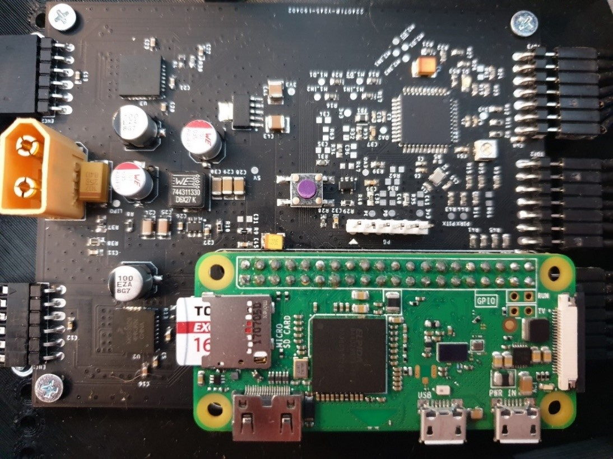

<!-- PROJECT SHIELDS -->
<!--
*** I'm using markdown "reference style" links for readability.
*** Reference links are enclosed in brackets [ ] instead of parentheses ( ).
*** See the bottom of this document for the declaration of the reference variables
*** for contributors-url, forks-url, etc. This is an optional, concise syntax you may use.
*** https://www.markdownguide.org/basic-syntax/#reference-style-links
-->

[![Contributors][contributors-shield]][contributors-url]
[![Forks][forks-shield]][forks-url]
[![Stargazers][stars-shield]][stars-url]
[![Issues][issues-shield]][issues-url]
[![LinkedIn][linkedin-shield]][linkedin-url]

<!-- PROJECT LOGO -->
<br />
<p align="center">

  <h1 align="center">Indoor Robot Explorer</h1>

  <p align="center">
    <a href="https://github.com/filipmanole/indoor-robot-explorer/issues">Report Bug</a>
    ·
    <a href="https://github.com/filipmanole/indoor-robot-explorer/issues">Request Feature</a>
  </p>
</p>

<!-- TABLE OF CONTENTS -->

## Table of Contents

- [About the Project](#about-the-project)
- [Software Tools](#software-tools)
- [Hardware](#hardware)
- [Getting Started](#getting-started)
  - [Prerequisites](#prerequisites)
  - [Usage](#usage)
- [Roadmap](#roadmap)
- [Contributing](#contributing)
- [License](#license)

<!-- ABOUT THE PROJECT -->

## About The Project

In recent years there has been an increase in interest in robots. There are billions of dollar spent on professional and personal use robots: autonomous vehicles, maintenance robots, cleaning robots. This repository offers a well structured, modular and low cost robot.

## Software Tools

Board layout was designed using [EAGLE 9.2.2](https://www.autodesk.com/products/eagle/overview?plc=F360&term=1-YEAR&support=ADVANCED&quantity=1)

Firmware was developed using:
- [MPLAB X 5.30](https://www.microchip.com/mplab/mplab-x-ide)
- dsPIC33E-GM-GP-MC-GU-MU_DFP 1.0.23
- [XC16](https://www.microchip.com/mplab/compilers) v1.50

Raspberry Pi specifications:
- [Raspbian GNU/Linux 9 (stretch)](https://www.raspberrypi.org/downloads/raspberry-pi-os/)
- [GCC](https://gcc.gnu.org/) version 6.3.0
- Python 2.7

## Hardware

### Main Components Used
- LiPo Battery 7V4 2200mA
- [dsPIC33EP128GM304](https://www.microchip.com/wwwproducts/en/dsPIC33EP128GM304) microcontroller
- 2x [MC33926](https://www.nxp.com/docs/en/data-sheet/MC33926.pdf) Motor Drivers
- 2x [Pololu ](https://www.pololu.com/product/2283) DC Motors
- 3x [VL53L0X]() Time of Flight Sensors
- [Raspberry Pi Zero W](https://www.raspberrypi.org/products/raspberry-pi-zero-w/)

In the `eagle_project` directory can be found the schematic, the layout design of the board and the Bill of Material. Those files can be used to send the board to manufacture and build the robot. You should obtain something like:



<!-- GETTING STARTED -->

## Getting Started

To get a local copy up and running follow these simple example steps.

### Prerequisites

Make sure you have the following:
- The tools specified in [Software Tools](#software-tools) section
- The robot obtained from the files in the `eagle_project` directory
- [PICkit™ 3](https://www.microchip.com/DevelopmentTools/ProductDetails/PG164130) to programm the robot
- `ssh` connection to the Raspberry Pi Zero W.

```sh
git clone https://github.com/filipmanole/indoor-robot-explorer.git
```

<!-- USAGE EXAMPLES -->

### Usage

Program the robot:
1. Open the MPLAB X project `driver.X`
2. Right click on the project and select `Build`
3. Program the robot using the PICkit 3

Copy the directory `robot-utils` on the Raspberry Pi:
```sh
scp robot-utils/ pi_user@raspberry_pi_address:~
```
Log on the Raspberry Pi:
```sh
ssh pi_user@raspberry_pi_address
```
Run commands to move the robots:
```sh
cd ~/robot-utils/commands
make build
robot start        # robot can be controlled now
robot run 0.3 0.1  # first argument is the linear velocity, the second is the angular velocity
robot pose         # returns the position of the robot x, y and tetha
robot stop         # the robot stops
```

Example of how to get data from the sensors:
```sh
cd ~/robot-utils/tof/VL53L0X
python VL53L0X_multi_example.py
```

<!-- ROADMAP -->

## Roadmap

See the [open issues](https://github.com/filipmanole/indoor-robot-explorer/issues) for a list of proposed features (and known issues).

<!-- CONTRIBUTING -->

## Contributing

Contributions are what make the open source community such an amazing place to be learn, inspire, and create. Any contributions you make are **greatly appreciated**.

1. Fork the Project
2. Create your Feature Branch (`git checkout -b feature/AmazingFeature`)
3. Commit your Changes (`git commit -m 'Add some AmazingFeature'`)
4. Push to the Branch (`git push origin feature/AmazingFeature`)
5. Open a Pull Request

<!-- LICENSE -->

## License

Distributed under the MIT License.

<!-- CONTACT -->

<!-- ACKNOWLEDGEMENTS -->

<!-- MARKDOWN LINKS & IMAGES -->
<!-- https://www.markdownguide.org/basic-syntax/#reference-style-links -->

[contributors-shield]: https://img.shields.io/github/contributors/filipmanole/indoor-robot-explorer.svg?style=flat-square
[contributors-url]: https://github.com/filipmanole/indoor-robot-explorer/graphs/contributors
[forks-shield]: https://img.shields.io/github/forks/filipmanole/indoor-robot-explorer.svg?style=flat-square
[forks-url]: https://github.com/filipmanole/indoor-robot-explorer/network/members
[stars-shield]: https://img.shields.io/github/stars/filipmanole/indoor-robot-explorer.svg?style=flat-square
[stars-url]: https://github.com/filipmanole/indoor-robot-explorer/stargazers
[issues-shield]: https://img.shields.io/github/issues/filipmanole/indoor-robot-explorer.svg?style=flat-square
[issues-url]: https://github.com/filipmanole/indoor-robot-explorer/issues
[linkedin-shield]: https://img.shields.io/badge/-LinkedIn-black.svg?style=flat-square&logo=linkedin&colorB=555
[linkedin-url]: https://www.linkedin.com/in/filip-george-manole/
[product-screenshot]: screenshot.png